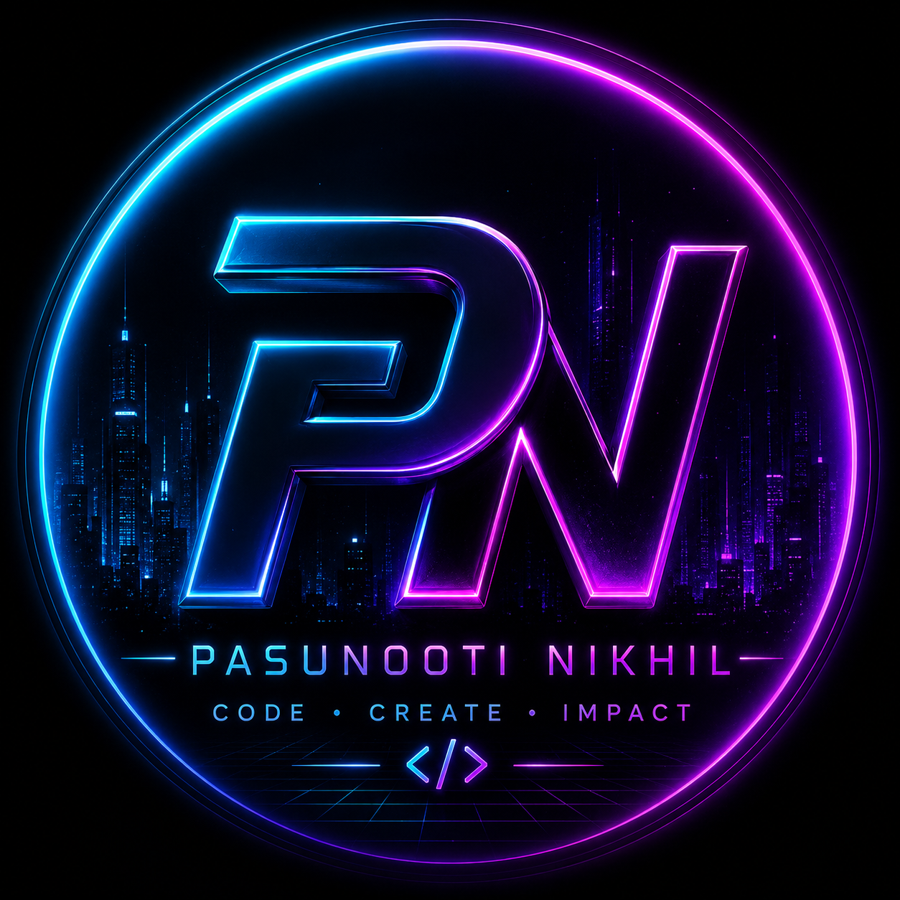

<div align="center">


<br/><br/>

<a href="https://git.io/typing-svg">
  
</a>

<br/><br/>

<a href="https://nikhilpasunooti.onrender.com">
  
</a>
<a href="https://in.linkedin.com/in/nikhil-pasunooti-231360305">
  
</a>
<a href="mailto:nikhilpasunooti@gmail.com">
  
</a>
<a href="https://nikhilpasunooti.onrender.com">
  
</a>

</div>

<br/>

<div align="center">
  
</div>

<br/>

## Digital Identity

```yaml
Name: Pasunooti Nikhil
Role: Software Engineer
Education: Anurag University
Graduation: 2026
Current Focus:
  - AI Agents
  - Full Stack Development
  - System Design
  - SaaS Products
Mission: Build products that solve real-world problems.
```

## About Me

I am a software engineer and full stack developer building at the intersection of AI systems, product engineering, and polished user experience. My work focuses on turning ambitious ideas into real, usable products with strong architecture, clean interfaces, and practical impact.

I like systems that feel intelligent, interfaces that feel premium, and engineering that stays simple enough to scale.

<br/>

## Flagship Project

<div align="center">
  
</div>

### DEVA AI Assistant

A next-generation AI assistant combining voice, intelligence, memory, automation, and natural conversation into a personal AI experience.

<table>
  <tr>
    <td width="50%"><strong>Voice Intelligence</strong><br/>Natural voice-first interaction for human-like control.</td>
    <td width="50%"><strong>GPT Integration</strong><br/>Advanced reasoning and conversational intelligence.</td>
  </tr>
  <tr>
    <td width="50%"><strong>Local LLM Support</strong><br/>Flexible AI workflows with privacy-aware local models.</td>
    <td width="50%"><strong>Persistent Memory</strong><br/>Context that carries across sessions and conversations.</td>
  </tr>
  <tr>
    <td width="50%"><strong>Automation</strong><br/>Task execution designed around real user workflows.</td>
    <td width="50%"><strong>Human-like Conversations</strong><br/>Designed to make AI feel personal, useful, and natural.</td>
  </tr>
</table>

<br/>

## Featured Projects

<div align="center">
  
</div>

### CodeQuest

A gamified Python learning platform designed to make coding practice feel like progression. CodeQuest blends RPG mechanics, spaced repetition, boss battles, XP rewards, streaks, and real-time code execution into a modern learning experience.

<br/>

<div align="center">
  
</div>

### Personal Developer Portfolio

A modern, interactive portfolio showcasing projects, skills, experience, and design taste through a futuristic visual system, smooth motion, and recruiter-friendly storytelling.

<br/>

## Tech Universe

<div align="center">
  
</div>

<br/>

<div align="center">

### Languages


### Frontend


### Backend


### Databases


### Tools


</div>

<br/>

## GitHub Dashboard

<div align="center">


<br/><br/>


<br/><br/>


</div>

<br/>

## Certifications

<table>
  <tr>
    <td width="50%"><strong>Azure AI Fundamentals</strong><br/>AI concepts, Azure AI services, and responsible AI foundations.</td>
    <td width="50%"><strong>Generative AI</strong><br/>Modern AI workflows, prompting, and applied AI product thinking.</td>
  </tr>
  <tr>
    <td width="50%"><strong>Python Programming</strong><br/>Core programming, problem solving, and backend automation.</td>
    <td width="50%"><strong>Design Thinking</strong><br/>Human-centered product design and structured innovation.</td>
  </tr>
</table>

## Current Goals

<table>
  <tr>
    <td align="center" width="25%"><strong>Build AI Products</strong></td>
    <td align="center" width="25%"><strong>Launch SaaS Products</strong></td>
    <td align="center" width="25%"><strong>Master System Design</strong></td>
    <td align="center" width="25%"><strong>Open Source Contributions</strong></td>
  </tr>
</table>

## Engineering Philosophy

```c
while (alive) {
    learn();
    build();
    improve();
    repeat();
}
```

## Contact

<div align="center">

<a href="https://in.linkedin.com/in/nikhil-pasunooti-231360305">
  
</a>
<a href="https://nikhilpasunooti.onrender.com">
  
</a>
<a href="mailto:nikhilpasunooti@gmail.com">
  
</a>
<a href="https://github.com/NikhilR53">
  
</a>

</div>

<br/>

<div align="center">


<br/><br/>

<h3>CODE • CREATE • IMPACT</h3>


</div>
