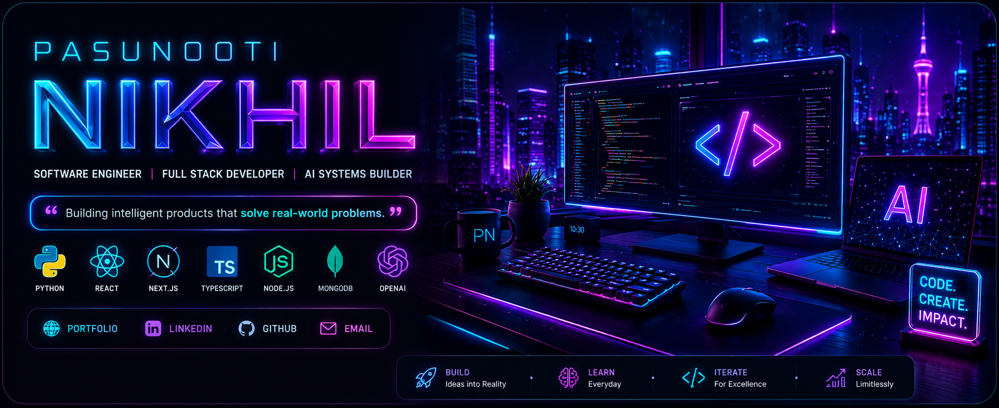
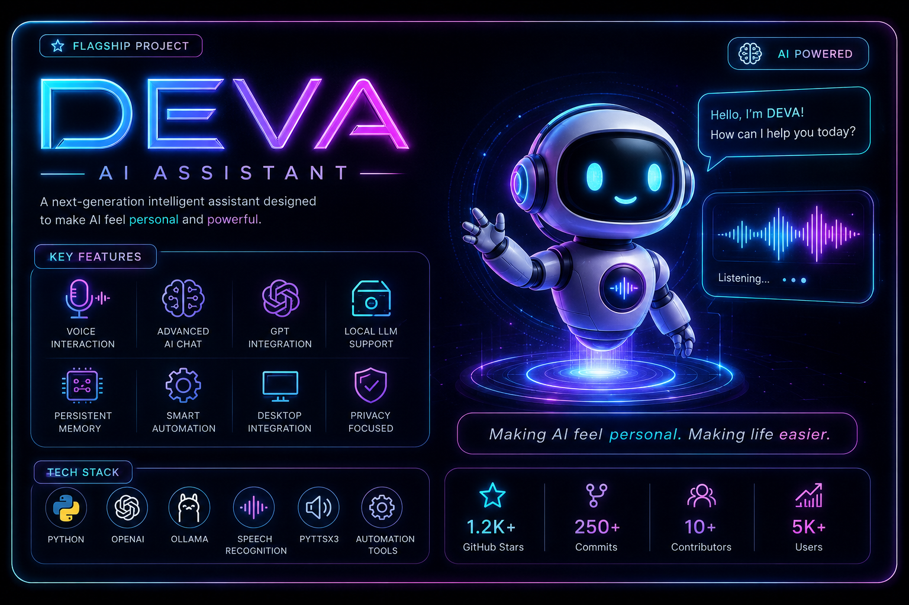
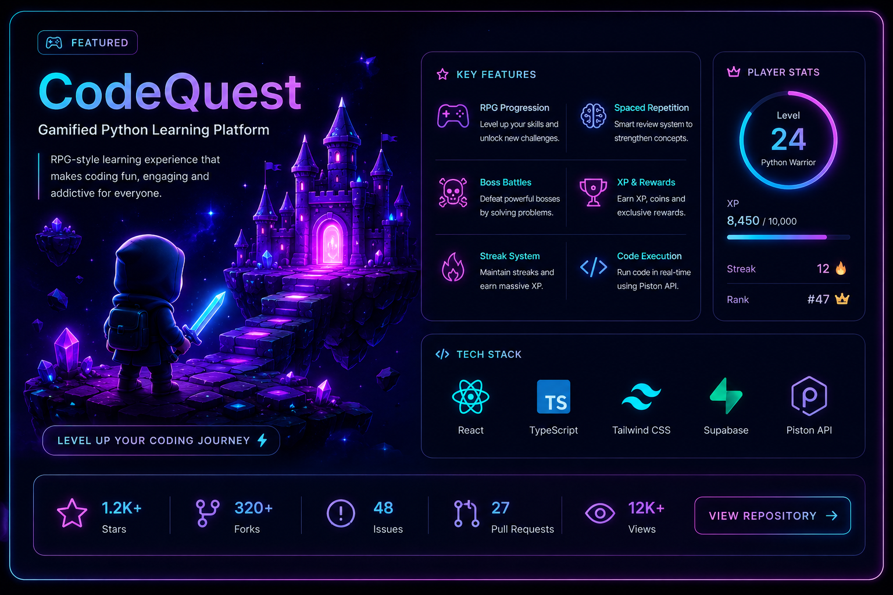
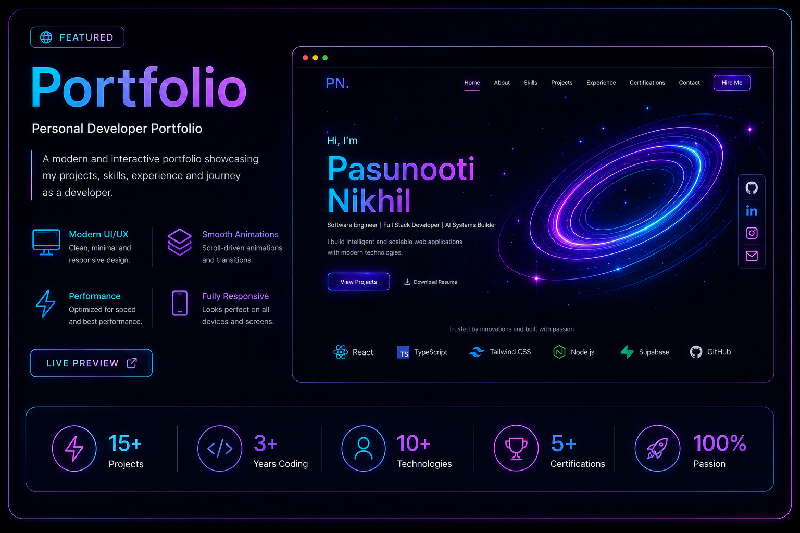
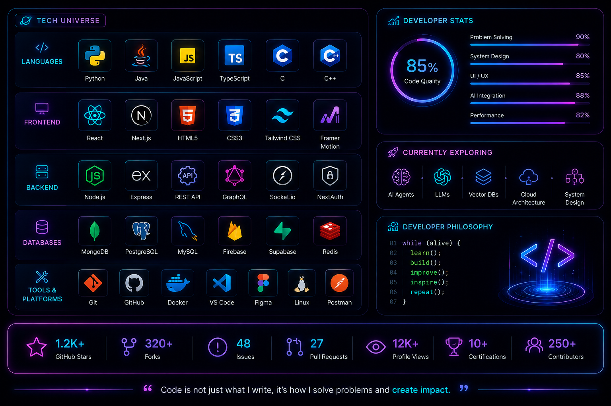
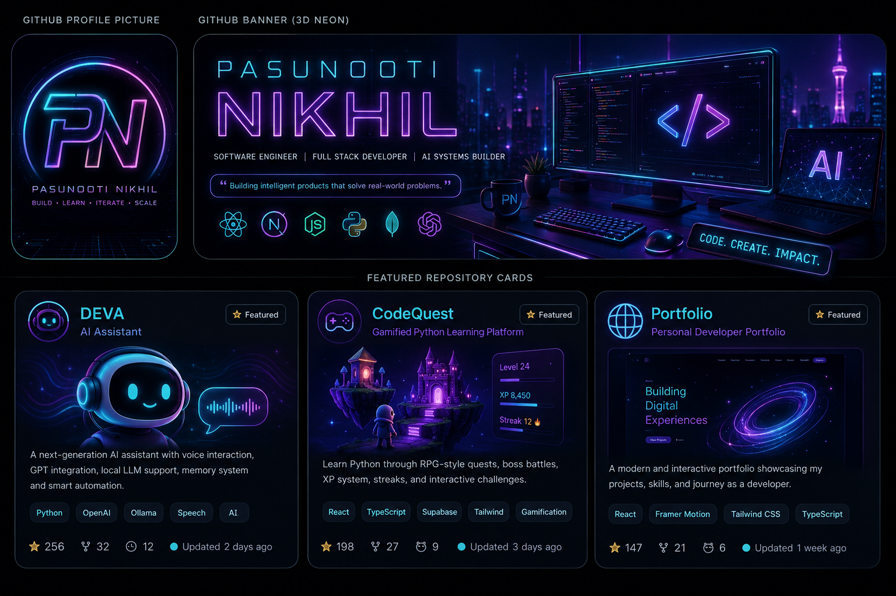

<div align="center">



<br/><br/>

<a href="https://git.io/typing-svg">
  
</a>

<br/><br/>

<a href="https://nikhilpasunooti.onrender.com">
  
</a>
<a href="https://in.linkedin.com/in/nikhil-pasunooti-231360305">
  
</a>
<a href="mailto:nikhilpasunooti@gmail.com">
  
</a>
<a href="https://nikhilpasunooti.onrender.com">
  
</a>

</div>

<br/>

## Digital Identity

```yaml
Name: Pasunooti Nikhil
Role: Software Engineer
Education: Anurag University
Graduation: 2026
Current Focus:
  - AI Agents
  - Full Stack Development
  - System Design
  - SaaS Products
Mission: Build products that solve real-world problems.
```

## About Me

I build intelligent, polished, and scalable software products with a strong focus on AI systems, full stack engineering, and premium product experience. My work blends practical engineering depth with a futuristic visual taste: clean systems, responsive interfaces, useful automation, and products that feel ready for real users.

Currently focused on AI agents, SaaS products, system design, and building DEVA into a personal assistant that feels powerful, natural, and useful.

<br/>

## Flagship Project

<div align="center">
  
</div>

### DEVA AI Assistant

A next-generation AI assistant designed to make AI feel personal, voice-first, and genuinely helpful.

<table>
  <tr>
    <td width="33%"><strong>Voice Intelligence</strong><br/>Natural speech interaction for fast, human-like control.</td>
    <td width="33%"><strong>GPT Integration</strong><br/>Conversational reasoning for practical AI workflows.</td>
    <td width="33%"><strong>Local LLM Support</strong><br/>Flexible model support with privacy-aware execution.</td>
  </tr>
  <tr>
    <td width="33%"><strong>Persistent Memory</strong><br/>Context that carries across sessions and conversations.</td>
    <td width="33%"><strong>Automation</strong><br/>Task execution designed around everyday workflows.</td>
    <td width="33%"><strong>Human-like Conversations</strong><br/>Built to feel personal, calm, and capable.</td>
  </tr>
</table>

<br/>

## Featured Projects

<div align="center">
  
</div>

### CodeQuest

A gamified Python learning platform built around RPG progression, spaced repetition, boss battles, XP rewards, streak systems, and real-time code execution.

<br/>

<div align="center">
  
</div>

### Personal Developer Portfolio

A cinematic portfolio experience for showcasing projects, skills, certifications, and engineering identity through motion, neon depth, and product-focused storytelling.

<br/>

## Tech Universe

<div align="center">
  
</div>


## GitHub Dashboard

<div align="center">


<br/><br/>


<br/><br/>


</div>

<br/>

## Certifications

<table>
  <tr>
    <td width="50%"><strong>Azure AI Fundamentals</strong><br/>AI concepts, Azure AI services, and responsible AI foundations.</td>
    <td width="50%"><strong>Generative AI</strong><br/>Modern AI workflows, prompting, and applied AI product thinking.</td>
  </tr>
  <tr>
    <td width="50%"><strong>Python Programming</strong><br/>Programming fundamentals, problem solving, and backend automation.</td>
    <td width="50%"><strong>Design Thinking</strong><br/>Human-centered product design and structured innovation.</td>
  </tr>
</table>

## Current Goals

<table>
  <tr>
    <td align="center" width="25%"><strong>Build AI Products</strong></td>
    <td align="center" width="25%"><strong>Launch SaaS Products</strong></td>
    <td align="center" width="25%"><strong>Master System Design</strong></td>
    <td align="center" width="25%"><strong>Open Source Contributions</strong></td>
  </tr>
</table>

## Engineering Philosophy

```c
while (alive) {
    learn();
    build();
    improve();
    repeat();
}
```

## Brand System

<div align="center">
  
</div>

## Contact

<div align="center">

<a href="https://in.linkedin.com/in/nikhil-pasunooti-231360305">
  
</a>
<a href="https://nikhilpasunooti.onrender.com">
  
</a>
<a href="mailto:nikhilpasunooti@gmail.com">
  
</a>
<a href="https://github.com/NikhilR53">
  
</a>

</div>

<br/>

<div align="center">


<br/><br/>

<h3>CODE • CREATE • IMPACT</h3>


</div>
